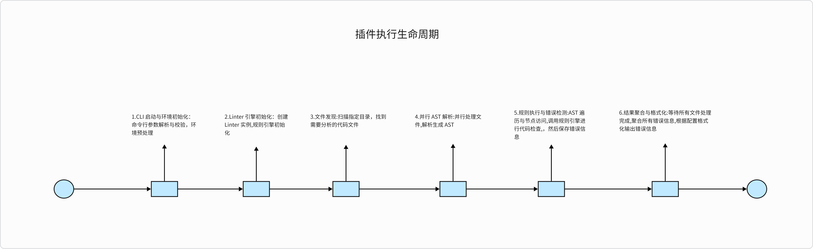
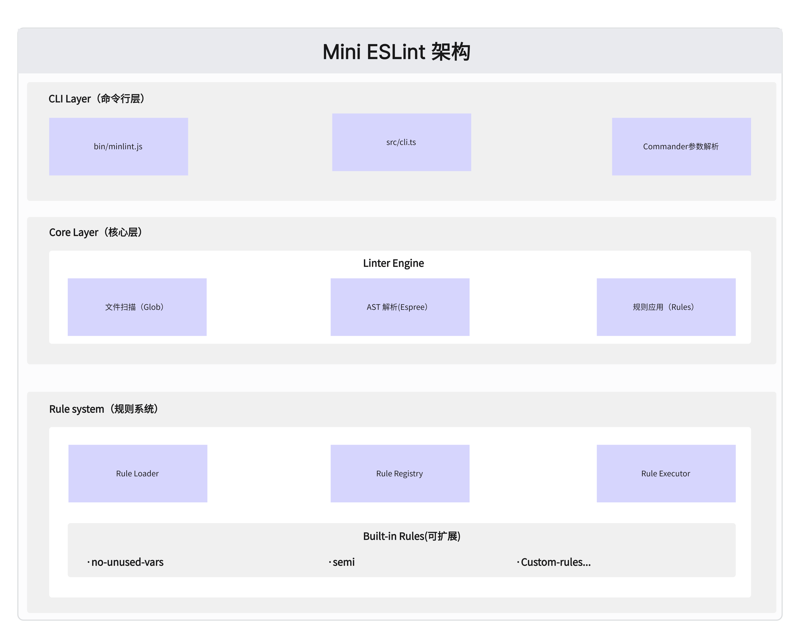
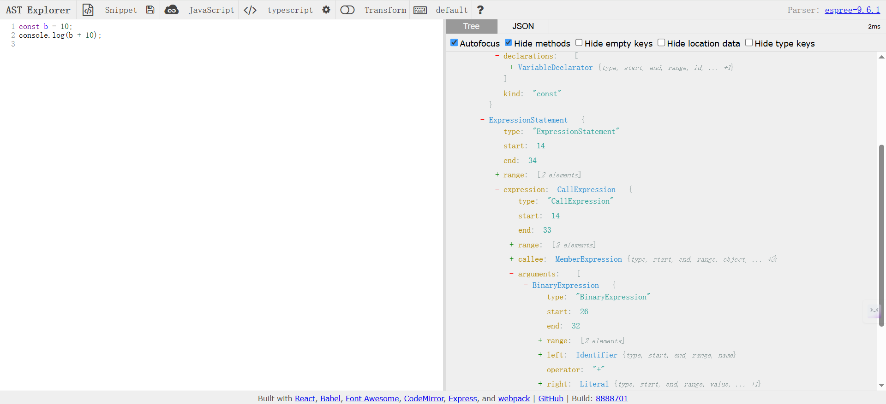

## 1. 前言

### 为什么要自己实现 ESLint？

在现代前端开发中，ESLint 已经成为不可或缺的代码质量保障工具。但是，作为开发者，我们是否真正理解它的工作原理？通过从零实现一个 Mini-ESLint，我们可以：

- **深入理解 AST（抽象语法树）**：掌握代码是如何被解析和分析的
- **学习编译原理实践**：将理论知识转化为实际的工程能力
- **掌握工具链开发**：了解如何构建开发者工具
- **提升代码分析能力**：为后续开发更复杂的代码工具打基础

### 核心技术栈

| 技术组件     | 选择方案     | 选择理由                           |
| ------------ | ------------ | ---------------------------------- |
| **解析器**   | Espree       | ESLint 官方解析器，ESTree 标准兼容 |
| **开发语言** | TypeScript   | 类型安全，开发体验好               |
| **构建工具** | esbuild      | 构建速度快，配置简单               |
| **测试框架** | Vitest       | 现代化，与 Vite 生态兼容           |
| **CLI 框架** | Commander.js | 功能完善，社区成熟                 |

## 2. 整体架构设计与实现

### 2.1 整体架构设计

#### 2.1.1 基础类设计

我们可以把代码分析，找出问题的过程中设计的变量和方法，都封装在一个名为 Linter 的类中。可以把它理解成代码分析流程的抽象，它是 mini-eslint 的核心，通过 new 生成分析实例后，我们可以通过分析实例来驱动整个分析流程。
下面是 Linter 基础类的代码框架简化版演示：

```typescript
/**
 * Linter 基础类
 * 这是 mini-eslint 的核心类，封装了代码分析流程的抽象
 * 设计理念：
 * - 单一职责：专注于代码分析流程编排
 * - 异步优先：支持大规模文件并行处理
 * - 可扩展性：插件化规则系统
 */
export class Linter {
  /** 文件模式列表，支持 glob 语法 */
  private filePatterns: string[];

  /** 加载的规则实例列表 */
  private rules: Rule[];

  /** 收集的错误信息 */
  private errors: LintError[];

  /** 合并后的配置对象 */
  private config: any;

  /** 异步分析完成标志 */
  private analysisComplete: Promise<void>;

  /**
   * 构造函数 - 初始化分析实例
   * @param options 配置选项
   */
  constructor(options: { files: string[]; configFile?: string }) {
    // 1. 存储文件模式
    this.filePatterns = options.files;
    this.errors = [];

    // 2. 配置系统初始化
    this.config = this.loadConfig(options.configFile);

    // 3. 规则系统激活
    this.initRules();

    // 4. 启动异步分析流程
    this.analysisComplete = this.startAnalysis();
  }

  /**
   * 配置加载与合并
   * 支持 JSON 和 JS 格式的配置文件
   */
  private loadConfig(configFile?: string): any {
    // 配置文件加载逻辑
    // 支持用户配置覆盖默认配置
    return {}; // 简化实现
  }

  /**
   * 规则系统初始化
   * 根据配置加载和过滤规则
   */
  private initRules(): void {
    // 规则加载和实例化逻辑
    this.rules = [];
  }

  /**
   * 启动分析流程
   * 文件扫描 → 解析 → 规则应用
   */
  private async startAnalysis(): Promise<void> {
    // 1. 文件发现与扫描
    const files = await this.scanFiles();

    // 2. 并行文件解析
    await this.parseFiles(files);
  }

  /**
   * 文件扫描系统
   * 将 glob 模式转换为具体文件列表
   */
  private async scanFiles(): Promise<string[]> {
    // glob 模式匹配逻辑
    // 去重和过滤处理
    return [];
  }

  /**
   * 并行文件解析
   * 同时处理多个文件以提升性能
   */
  private async parseFiles(files: string[]): Promise<void> {
    // Promise.all 并行处理
    await Promise.all(files.map((file) => this.parseFile(file)));
  }

  /**
   * 单文件解析核心流程
   * 源代码 → AST → 规则应用
   */
  private async parseFile(filePath: string): Promise<void> {
    try {
      // 1. 读取源代码
      const sourceCode = this.readSourceCode(filePath);

      // 2. 生成 AST
      const ast = this.parseToAST(sourceCode, filePath);

      // 3. 应用规则分析
      await this.analyzeAST(ast, filePath, sourceCode);
    } catch (error) {
      // 错误处理和报告
      this.handleParseError(error, filePath);
    }
  }

  /**
   * 源代码读取
   */
  private readSourceCode(filePath: string): string {
    // 文件读取逻辑
    return "";
  }

  /**
   * AST 解析
   * 使用 Espree 解析器生成抽象语法树
   */
  private parseToAST(sourceCode: string, filePath: string): any {
    // Espree 解析配置
    // 支持 JSX、TypeScript 等
    return {};
  }

  /**
   * AST 分析与规则应用
   * 遍历 AST 节点，触发规则检查
   */
  private async analyzeAST(
    ast: any,
    filePath: string,
    sourceCode: string
  ): Promise<void> {
    // 遍历所有激活的规则
    for (const rule of this.rules) {
      // 创建规则上下文
      const context = this.createRuleContext(rule, filePath);

      // 创建规则监听器
      const listener = rule.create(context);

      // 遍历 AST 应用规则
      this.traverseAST(ast, listener);
    }
  }

  /**
   * 创建规则上下文
   * 为规则提供报告错误的能力
   */
  private createRuleContext(rule: any, filePath: string): any {
    return {
      report: (data: any) => {
        // 收集错误信息
        this.errors.push({
          ...data,
          filePath,
          ruleId: rule.meta.name,
        });
      },
      options: this.getRuleOptions(rule),
      getSourceCode: () => this.getSourceCode(filePath),
    };
  }

  /**
   * AST 遍历
   * 深度优先遍历，触发节点事件
   */
  private traverseAST(ast: any, listener: any): void {
    // 深度优先遍历逻辑
    // 触发节点进入和退出事件
  }

  /**
   * 获取规则配置选项
   */
  private getRuleOptions(rule: any): any[] {
    // 解析规则配置选项
    return [];
  }

  /**
   * 错误处理
   */
  private handleParseError(error: any, filePath: string): void {
    // 分类处理语法错误和解析错误
    console.error(`解析文件 ${filePath} 时出错:`, error);
  }

  /**
   * 获取源代码
   */
  private getSourceCode(filePath: string): string {
    // 返回指定文件的源代码
    return "";
  }

  /**
   * 获取分析结果
   * 等待所有异步分析完成后返回错误列表
   */
  public async getErrors(): Promise<LintError[]> {
    // 等待分析完成
    await this.analysisComplete;
    return this.errors;
  }

  /**
   * 获取分析统计信息
   */
  public getStats(): AnalysisStats {
    return {
      filesProcessed: this.filePatterns.length,
      errorsFound: this.errors.length,
      rulesApplied: this.rules.length,
    };
  }
}
```

基础类中包括输入的文件模式列表、规则列表、错误信息列表、配置、分析完成的 Promise、配置文件加载方法、规则初始化方法、文件扫描和解析方法、批量文件解析方法、单个文件解析方法、抽象语法树分析方法、规则选项获取方法、错误信息获取方法。这些在后续我们都会具体介绍实现。

#### 2.1.2 执行生命周期

我们根据 mini-eslint 入口函数 cli 的详细调用链路，将工具的执行时序梳理后，可以得到 mini-eslint 的执行生命周期：



#### 2.1.3 模块架构图

仅仅靠一个 Linter 基础类是无法完成依赖调用分析整个流程的，它是分析工具的核心，但不是全部，我们还需要其它模块来辅助它完成分析任务，代码分析工具的架构设计如下图：



**模块间通信原则：**

- 核心层向上提供稳定 API
- 规则层通过插件机制扩展
- 命令行层负责用户交互

可以对照[完整代码](https://github.com/lzj2000/mini-eslint)来理解 mini-eslint 的代码组织模式。

### 2.3 具体实现

#### 2.3.1 AST 处理与工具

##### AST 解析与处理详解

**什么是 AST（抽象语法树）？**

抽象语法树（Abstract Syntax Tree，简称 AST）是源代码语法结构的树形抽象表示。它将代码的语法结构以层次化的节点形式组织，每个节点代表源代码中的一个语法构造。

**为什么需要 AST？**

在代码静态分析中，AST 具有以下重要作用：

- **结构化表示**：将线性的源代码转换为结构化的树形数据
- **语法无关性**：抽象掉具体的语法细节，专注于语义结构
- **便于分析**：通过遍历树节点可以系统地分析代码模式
- **位置信息**：保留代码在源文件中的精确位置，便于错误定位

**AST 节点类型详解**

让我们通过具体示例了解常见的 AST 节点类型：

**1. 字面量（Literal）节点**

```javascript
// 各种字面量及其对应的 AST 节点类型
let name = "xl"; // 'xl' → StringLiteral（字符串字面量）
let age = 20; // 20 → NumericLiteral（数字字面量）
```

**2. 标识符（Identifier）节点**

```javascript
// 标识符：变量名、函数名、属性名等
import { glob } from "glob"; // glob → Identifier
let name = "xl"; // name → Identifier
```

**3. 语句（Statement）节点**

```javascript
// 语句：代码执行的基本单位
return userData; // ReturnStatement（返回语句）
if (condition) {
  doSomething();
} // IfStatement（条件语句）
```

**4. 声明（Declaration）节点**

```javascript
// 声明：特殊的语句类型，用于声明变量、函数、类等
let name = "xl"; // VariableDeclaration（变量声明）
let age = 20; // VariableDeclaration（变量声明）
import fs from "fs"; // ImportDeclaration（导入声明）
```

**5. 导入导出节点**

```javascript
// 默认导入
import React from "react"; // ImportDeclaration + ImportDefaultSpecifier

// 命名导入
import { useState, useEffect } from "react"; // ImportDeclaration + ImportSpecifier

// 命名空间导入
import * as fs from "fs"; // ImportDeclaration + ImportNamespaceSpecifier

// 混合导入
import React, { Component } from "react"; // ImportDeclaration + 多种 Specifier

// 默认导出
export default function App() {} // ExportDefaultDeclaration

// 命名导出
export const config = {}; // ExportNamedDeclaration

// 重新导出
export { Button } from "./components"; // ExportNamedDeclaration + ExportSpecifier
```

**AST 可视化工具**

为了更好地理解 AST 结构，推荐使用以下工具：

1.  **[AST Explorer](https://astexplorer.net/#/gist/f9da6d62623c8e6cb359c76f54b26b1a/6189496315da4ae42aebb4f3c63f7fa4c442bcba)**

    - 在线 AST 可视化工具
    - 支持多种编程语言和解析器
    - 实时显示代码对应的 AST 结构
    - 可以切换不同的 parser（如 espree、babel 等）

2.  **使用示例**

    ```javascript
    // 在 AST Explorer 中输入这段代码
    const message = "Hello World";
    console.log(message);

    // 可以看到对应的 AST 结构：
    // Program
    // └── VariableDeclaration
    //     └── VariableDeclarator
    //         ├── Identifier (message)
    //         └── Literal ("Hello World")
    // └── ExpressionStatement
    //     └── CallExpression
    //         ├── MemberExpression
    //         │   ├── Identifier (console)
    //         │   └── Identifier (log)
    //         └── Identifier (message)
    ```



**在 Mini ESLint 中的 AST 应用**

在我们的 Mini ESLint 实现中，AST 的处理流程如下：

1.  **解析阶段**：使用 Espree 将源代码解析为 AST
2.  **遍历阶段**：深度优先遍历所有节点
3.  **规则应用**：每个规则监听特定类型的节点事件
4.  **错误收集**：规则在检测到问题时报告错误信息

#### 2.3.2 CLI 启动与环境初始化

##### CLI 模式概述

CLI 模式即命令行模式，可以配合 npm script 来驱动，入口为可执行脚本。命令行模式在分析前会对命令行参数以及配置文件参数进行校验，对分析环境进行预处理。

##### 项目入口与构建流程

**1. 可执行文件入口**

项目通过 `package.json` 中的 `bin` 字段定义了可执行命令（指定**可执行文件**的路径）：

```json
{
  "bin": {
    "minlint": "bin/minlint.js"
  }
}
```

`bin/minlint.js` 作为可执行脚本的入口，第一行的 `#!/usr/bin/env node` 表示该文件是一个可执行脚本：

```js
#!/usr/bin/env node

require("../dist/cli.js");
```

##### CLI 核心实现

**依赖导入与程序初始化**

```js
import { Command } from "commander";
import chalk from "chalk";
import fs from "fs";
import path from "path";

import { version } from "../package.json";
import { Linter } from "./linter";
import { stylish } from "./formatter/stylish";

const program = new Command();

// 程序标题
console.log(chalk.bold.cyan("\n=== MiniESLint ===") + " 轻量级代码检查工具\n");

program
  .name("mini-eslint")
  .description("一个轻量级代码检查工具")
  .version(version, "-v, --version", "显示版本号")
  .argument(
    "[files...]",
    '要检查的文件或glob模式（默认: "src/**/*.{js,ts,jsx,tsx}"）'
  )
  .option("-c, --config <path>", '配置文件路径（默认: ".minlintrc.{json,js}"）')
  .action(async (files: string[], options: any) => {
    try {
      // 处理配置文件路径
      let configFile = options.config;
      if (!configFile) {
        const defaultConfigPaths = [
          path.join(process.cwd(), ".minlintrc.json"),
          path.join(process.cwd(), ".minlintrc.js"),
        ];
        for (const configPath of defaultConfigPaths) {
          if (fs.existsSync(configPath)) {
            configFile = configPath;
            break;
          }
        }
      }

      // 处理文件路径
      if (files.length === 0) {
        files = ["src/**/*.{js,ts,jsx,tsx}"];
        if (!fs.existsSync(path.join(process.cwd(), "src"))) {
          console.log(
            chalk.yellow("注意: 'src' 目录不存在，将检查当前目录下的所有JS文件")
          );
          files = ["**/*.{js,ts,jsx,tsx}"];
        }
      }

      // 初始化Linter并执行检查
      const linter = new Linter({ files, configFile });
      const errors = await linter.getErrors();
      stylish(errors);

      // 设置退出码
      process.exitCode = errors.length > 0 ? 1 : 0;
    } catch (error) {
      console.error(error);
      process.exit(1);
    }
  });

// 解析命令行参数
program.parse(process.argv);
```

上述代码使用了这些核心依赖包：

- **commander**: 命令行参数解析和命令定义
- **chalk**: 终端彩色输出
- **fs/path**: Node.js 内置文件系统和路径处理模块

**核心处理流程**：

1.  配置文件自动发现（优先用户指定，其次查找默认配置）
2.  文件路径智能处理（默认 src 目录，回退到当前目录）
3.  Linter 引擎初始化和执行
4.  结果格式化输出和退出码设置

#### 2.3.3 Linter 核心引擎实现

##### Linter 类架构设计

**类属性设计说明**

```typescript
export class Linter {
  private filePatterns: string[]; // 文件模式数组，支持 glob 语法
  private rules: Rule[]; // 加载的规则实例列表
  private errors: LintError[]; // 收集的错误信息
  private config; // 合并后的配置对象
  private analysisComplete: Promise<void>; // 异步分析完成标志
}
```

**为什么这样设计？**

1.  **异步架构**：`analysisComplete` Promise 确保所有文件分析完成后才返回结果
2.  **错误收集**：`errors` 数组集中管理所有文件的检查结果
3.  **配置驱动**：`config` 对象控制规则启用状态和选项
4.  **规则实例化**：`rules` 数组包含所有激活的规则实例

##### Linter 核心引擎实现

```typescript
constructor(options: { files: string[]; configFile?: string }) {
  this.filePatterns = options.files;
  this.errors = [];
  this.rules = [];

  // 配置文件加载与合并
  if (options.configFile) {
    this.config = this.loadConfigFile(options.configFile);
  } else {
    this.config = defaultConfig;
  }

  // 规则初始化
  this.initRules();

  // 启动异步文件扫描和解析流程
  this.analysisComplete = this.scanAndParseFiles();
}
```

初始化流程说明：

1.  **文件模式存储**：将用户提供的文件模式（支持 glob 语法）存储到 filePatterns 属性
2.  **错误容器初始化**：创建空的错误数组用于收集所有检查结果
3.  **配置系统启动**：根据是否提供配置文件路径，选择加载用户配置或使用默认配置
4.  **规则系统激活**：调用 initRules() 方法加载和过滤规则
5.  **异步分析启动**：立即开始文件扫描和解析流程，但不阻塞构造函数返回

##### 配置系统解析

配置文件加载是 Linter 初始化的关键步骤，它决定了哪些规则会被应用以及如何应用：

```typescript
private loadConfigFile(configFilePath: string) {
  try {
    const configFileContent = fs.readFileSync(configFilePath, "utf-8");
    const fileExtension = path.extname(configFilePath);

    let userConfig;
    if (fileExtension === ".json") {
      userConfig = JSON.parse(configFileContent);  // JSON 格式解析
    } else if (fileExtension === ".js") {
      const absolutePath = path.resolve(configFilePath);
      userConfig = require(absolutePath);          // JS 模块加载
    } else {
      throw new Error(`不支持的配置文件格式: ${fileExtension}`);
    }

    // 配置合并策略：用户配置覆盖默认配置
    const mergedConfig = mergeConfigs(defaultConfig, userConfig);
    return mergedConfig;
  } catch (error) {
    console.warn(`读取配置文件失败，使用默认配置: ${error.message}`);
    return defaultConfig;
  }
}
```

这个方法实现配置加载机制：支持 JSON 和 JS 两种格式；使用 `path.resolve()` 确保 require 能正确加载 JS 配置文件；配置加载失败时自动降级到默认配置，保证 Linter 始终能够运行。配置合并策略让用户可以只覆盖需要修改的部分，而不必重新定义整个配置。

##### 文件发现与扫描系统

文件扫描是 Linter 工作流程的第一步，需要将用户提供的文件模式转换为具体的文件列表：

```typescript
private async scanAndParseFiles(): Promise<void> {
  let allMatchedFiles: string[] = [];

  // 遍历每个文件模式
  for (const pattern of this.filePatterns) {
    try {
      const matchedFiles = await glob(pattern, {
        ignore: "node_modules/**",    // 性能优化：忽略依赖目录
        absolute: false,              // 使用相对路径便于显示
      });
      allMatchedFiles.push(...matchedFiles);
    } catch (error) {
      console.error(`处理文件模式 "${pattern}" 时出错:`, error);
    }
  }

  // 去重处理（避免重复文件）
  const uniqueFiles = [...new Set(allMatchedFiles)];
  await this.parseMultipleFiles(uniqueFiles);
}
```

这个方法的目的是获取需要分析的文件列表：自动忽略 `node_modules` 目录避免扫描大量无关文件，使用 Set 数据结构自动去重，错误隔离确保单个模式失败不影响其他模式。扫描完成后直接调用批量解析方法。

配置合并策略，将用户配置与默认配置合并，用户配置优先级高：

```typescript
export function mergeConfigs(defaultConfig: any, userConfig: any): any {
  const merged = { ...defaultConfig };

  if (userConfig.rules) {
    merged.rules = { ...defaultConfig.rules, ...userConfig.rules };
  }

  return merged;
}
```

##### 并行文件解析架构

并行处理策略同时解析多个文件：

```typescript
private async parseMultipleFiles(files: string[]): Promise<void> {
  // Promise.all 实现并行处理，提升性能
  await Promise.all(
    files.map(async (file) => {
      try {
        await this.parseSingleFile(file);
      } catch (error) {
        console.error(`解析文件 ${file} 时出错:`, error);
        // 单文件错误不中断整体流程
      }
    })
  );
}
```

**单文件 AST 解析流程**

单文件解析是整个 Linter 系统的核心环节，它将源代码转换为可分析的 AST 结构：

```typescript
async parseSingleFile(filePath: string) {
  try {
    // 1. 读取源代码
    const sourceCode = fs.readFileSync(filePath, "utf-8");

    // 2. 文件类型检测
    const fileExtension = path.extname(filePath);
    const isJSXFile = fileExtension === ".jsx" || fileExtension === ".tsx";

    // 3. 解析器配置
    const parserOptions = {
      ecmaVersion: "latest" as const,
      sourceType: "module" as const,
      ecmaFeatures: {
        jsx: isJSXFile,              // 动态启用 JSX 支持
        globalReturn: false,
        impliedStrict: true,
      },
      range: true,                   // 字符位置信息
      loc: true,                     // 行列位置信息
      comments: true,                // 注释保留
      tokens: true,                  // Token 信息
    };

    // 4. 生成 AST
    const abstractSyntaxTree = espree.parse(sourceCode, parserOptions);

    // 5. AST 分析
    await this.analyzeAbstractSyntaxTree(abstractSyntaxTree, filePath, sourceCode);

    return abstractSyntaxTree;
  } catch (error) {
    // 错误分类处理
    if (error instanceof SyntaxError) {
      console.error(`✗ 语法错误 ${filePath}:`, error.message);
    } else {
      console.error(`✗ 解析错误 ${filePath}:`, error);
    }
    throw error;
  }
}
```

这个方法目的是将代码解析成 AST：首先读取源代码内容，然后根据文件扩展名动态配置解析器（JSX 支持），接着使用 Espree 生成 AST，最后调用分析方法应用规则。错误处理区分了语法错误和其他解析错误，为用户提供更精确的错误信息。位置信息的保留确保了后续错误报告的准确性。

##### AST 遍历与规则应用

AST 遍历是 Linter 的核心机制，通过深度优先遍历访问每个节点，并触发对应的规则监听器：

```typescript
// ast-utils.ts 中的 traverse 函数 - 核心遍历逻辑
export function traverse(ast: AST, listener: RuleListener) {
  const visit = (node: ASTNode, parent: ASTNode | null = null) => {
    if (!node || typeof node !== "object") return;

    // 触发节点进入事件
    if (node.type && typeof listener[node.type] === "function") {
      listener[node.type](node);
    }

    // 处理退出事件（如 'Program:exit'）
    if (node.type && typeof listener[`${node.type}:exit`] === "function") {
      // 先遍历子节点，再调用退出方法
      for (const key in node) {
        if (key === "type" || key === "loc" || key === "range") continue;
        const child = node[key];
        if (Array.isArray(child)) {
          child.forEach((item) => visit(item, node));
        } else {
          visit(child, node);
        }
      }
      listener[`${node.type}:exit`](node);
      return;
    }

    // 递归遍历子节点
    for (const key in node) {
      if (key === "type" || key === "loc" || key === "range") continue;
      const child = node[key];
      if (Array.isArray(child)) {
        child.forEach((item) => visit(item, node));
      } else {
        visit(child, node);
      }
    }
  };

  visit(ast); // 从根节点开始遍历
}
```

这个函数实现了深度优先遍历，支持节点进入和退出事件，能够正确处理数组类型的子节点，并跳过元数据属性。遍历过程中会触发规则监听器的相应方法，实现了事件驱动的规则应用机制。

规则应用过程中，系统会为每个激活的规则创建监听器，并通过 traverse 函数应用到 AST 上：

```typescript
// 规则应用与错误收集的核心逻辑
async analyzeAbstractSyntaxTree(ast: AST, filePath: string, sourceCode: string) {
  try {
    for (const rule of this.rules) {
      const ruleOptions = this.getRuleOptions(rule);
      const ruleName = rule.meta.name;
      const ruleConfig = this.config?.rules?.[ruleName];

      // 解析错误级别
      let severity: "error" | "warn" = "error";
      if (ruleConfig === "warn" ||
          (Array.isArray(ruleConfig) && ruleConfig[0] === "warn")) {
        severity = "warn";
      }

      // 创建规则上下文和监听器
      const listener = rule.create({
        report: (data) => {
          this.errors.push({
            ...data,
            filePath,
            severity,
          });
        },
        options: ruleOptions,
        getSourceCode: () => sourceCode,
      });

      // 应用规则到 AST
      traverse(ast, listener);
    }
  } catch (error) {
    console.error(`分析 ${filePath} 的抽象语法树时出错:`, error);
  }
}
```

这段代码遍历所有激活的规则，为每个规则创建上下文对象（包含 report 函数用于收集错误），然后通过 traverse 函数将规则监听器应用到 AST 上，实现代码检查。错误级别的解析让用户可以灵活控制问题的严重程度。

##### 错误信息管理

错误信息管理采用异步机制：

```typescript
async getErrors(): Promise<LintError[]> {
  await this.analysisComplete;
  return this.errors;
}
```

`getErrors` 方法通过等待 `analysisComplete` Promise 确保所有异步分析任务完成，然后返回错误列表。

#### 2.3.4 规则系统架构

规则系统是 Mini-ESLint 的核心组件，负责定义、加载、管理和执行各种代码检查规则。它采用插件化架构，支持规则的动态加载和配置驱动的执行。

##### 规则接口设计

核心接口定义：

```typescript
export interface Rule {
  meta: {
    name: string; // 规则名称，用于配置和错误报告
    docs: string; // 规则文档说明
    schema: any; // 规则选项的 JSON Schema
  };
  create(ctx: RuleContext): RuleListener; // 规则工厂函数
}

export interface RuleContext {
  report: (data: {
    // 错误报告函数
    node: ASTNode;
    // 错误信息
    message: string;
    // 规则 ID
    ruleId: string;
    line: number;
    column: number;
  }) => void;
  options?: string[]; // 规则配置选项
  getSourceCode: () => string; // 获取源代码函数
}

export interface RuleListener {
  [key: string]: (node: ASTNode) => void; // AST 节点监听器映射
}
```

我们设计的规则主要有 meta 和 create 两个部分，meta 部分定义了规则的元数据，如规则名称、文档说明和选项的 JSON Schema。create 部分是一个工厂函数，根据上下文创建规则监听器，在规则监听器中实现具体的检查逻辑，然后通过 ctx.report 函数报告错误。这样做到好处是：

1.  规则的定义和实现分离，规则定义只关注元数据和选项，而具体的检查逻辑在 create 方法中实现，符合单一职责原则。
2.  规则的动态创建和配置，通过 create 方法根据上下文创建规则监听器，实现了规则的动态加载和配置。
3.  规则的可扩展性，通过定义规则接口和上下文对象，支持规则的扩展和定制。
4.  规则的错误报告，通过 ctx.report 函数报告错误，确保错误信息格式一致。

具体接口设计原理：

1.  create 方法采用工厂模式，根据上下文创建规则监听器，实现了规则的动态创建和配置。

```typescript
// 工厂模式的实际应用示例
const ruleContext = {
  report: (data) => this.errors.push(data),
  options: this.getRuleOptions(rule),
  getSourceCode: () => sourceCode,
};

// 每次分析都创建新的监听器实例
const listener = rule.create(ruleContext);
```

2.  RuleListener 接口通过节点类型名称映射到处理函数，实现了对特定 AST 节点的监听和处理。我们只需要处理我们关注的节点类型即可，每种节点类型的处理可以逻辑分离。

```typescript
// 事件驱动的监听器示例
const listener: RuleListener = {
  // 监听变量声明节点
  VariableDeclarator: (node) => {
    // 处理变量声明逻辑
  },

  // 监听标识符节点
  Identifier: (node) => {
    // 处理标识符逻辑
  },

  // 监听程序退出事件
  "Program:exit": (node) => {
    // 程序分析完成后的清理工作
  },
};
```

3.  RuleContext 提供规则执行所需的所有上下文信息，如错误报告函数、规则选项和源代码获取函数。我们可以在规则监听器中通过 ctx 访问这些信息，统一的 report 函数确保错误信息格式一致，options 数组支持复杂的规则配置，getSourceCode 支持需要分析原始代码的高级规则。

```typescript
// 上下文注入的完整示例
interface RuleContext {
  // 错误报告函数 - 核心功能
  report: (data: {
    node: ASTNode; // 问题节点
    message: string; // 错误描述
    ruleId: string; // 规则标识
    line: number; // 行号
    column: number; // 列号
  }) => void;

  // 规则配置选项 - 灵活配置
  options?: string[]; // 如 ["always", "never"]

  // 源代码获取 - 高级分析
  getSourceCode: () => string; // 获取完整源代码
}
```

##### 规则实现模式分析

我们通过两个规则讲解一下怎么实现规则：

1.  Semi 规则：

- 规则名称：semi
- 规则文档：要求在语句末尾添加分号
- 规则选项：always 或 never
- 规则实现：在 create 方法中监听 Statement 节点，判断语句是否以分号结尾，根据选项判断是否报告错误。

  分析一下上面的介绍，我们需要在对应的节点做判断，违反规则的时候立即返回，代码如下：

```typescript
export default {
  meta: {
    name: "semi",
    docs: "Require or disallow semicolons instead of ASI",
    schema: {
      enum: ["always", "never"],
      default: "always",
    },
  },
  create(ctx: RuleContext): RuleListener {
    const defaultConfig = ctx.options?.[0] || "always";
    const isSemicolonRequired = defaultConfig === "always";
    const sourceCode = ctx.getSourceCode();
    const types = [
      "VariableDeclaration", // 变量声明: const a = 1;
      "ExpressionStatement", // 表达式语句: console.log();
      "ReturnStatement", // 返回语句: return value;
      "ThrowStatement", // 抛出语句: throw new Error();
      "BreakStatement", // 中断语句: break;
      "ContinueStatement", // 继续语句: continue;
      "ImportDeclaration", // 导入语句: import { a } from 'b';
      "ExportNamedDeclaration", // 命名导出: export { a };
      "ExportDefaultDeclaration", // 默认导出: export default a;
      "ExportAllDeclaration", // 全部导出: export * from 'module';
    ];

    // 检查分号的通用函数
    function checkSemicolon(node: ASTNode) {
      const lastToken = sourceCode.charAt(node.end - 1);
      const hasSemicolon = lastToken === ";";

      const { line, endColumn } = getNodeLocation(node);
      if (isSemicolonRequired && !hasSemicolon) {
        // 缺少分号：报告应该添加分号的位置（语句结束位置）
        ctx.report({
          node: node,
          message: `Missing semicolon.`,
          ruleId: "semi",
          line: line,
          column: endColumn,
        });
      } else if (!isSemicolonRequired && hasSemicolon) {
        // 多余分号：报告分号本身的位置
        ctx.report({
          node: node,
          message: `Extra semicolon.`,
          ruleId: "semi",
          line: line,
          column: endColumn,
        });
      }
    }

    // 动态生成监听器对象
    const listeners: RuleListener = {};
    types.forEach((type) => {
      listeners[type] = checkSemicolon;
    });
    return listeners;
  },
};
```

在 create 函数的实现中，代码首先解析配置选项来确定是否需要分号，然后定义了一个不同 AST 节点类型的数组（如变量声明、表达式语句、返回语句等），这些都是需要分号的语句类型。核心的 checkSemicolon 函数负责检查每个节点是否符合分号规则：它通过检查节点末尾字符来判断是否存在分号，然后根据配置要求报告相应的错误（缺少分号或多余分号）。最后，代码动态生成监听器对象，为每种节点类型绑定相同的检查函数，实现了高效的事件驱动检查机制。这种设计体现了 ESLint 规则系统的核心特点：配置驱动、事件监听和精确错误报告。

2.  no-unused-vars 规则

- 规则名称：no-unused-vars
- 规则文档：不允许定义未使用的变量
- 规则选项：无

  同样分析一下这个规则，我们需要记录所有声明的变量，在 Identifier 节点中记录所有使用的变量，最后遍历所有声明的变量，判断是否有未被使用的变量。代码如下：

```typescript
export default {
  meta: {
    name: "no-unused-vars",
    docs: "disallow unused variables",
    schema: [],
  },
  create(ctx: RuleContext): RuleListener {
    // 存储所有声明的变量
    const declared = new Set<string>();
    // 存储所有使用的变量
    const used = new Set<string>();
    // 存储变量声明节点信息，用于报告错误时定位
    const declaredInfo = new Map<string, ASTNode>();
    // 临时存储正在处理的变量声明
    const declaredUsed = new Set<string>();
    // 存储所有导出的变量
    const exportedVars = new Set<string>();

    return {
      // 处理变量声明
      VariableDeclarator(node) {
        declared.add(node.id.name);
        declaredUsed.add(node.id.name);
        declaredInfo.set(node.id.name, node);
      },
      // 处理标识符（变量使用）
      Identifier(node) {
        if (!declaredUsed.has(node.name)) {
          used.add(node.name);
        }
      },
      // 处理导出声明
      ExportNamedDeclaration(node) {
        // 处理 export const/let/var 声明
        if (
          node.declaration &&
          node.declaration.type === "VariableDeclaration"
        ) {
          const declarations = node.declaration.declarations;
          for (const decl of declarations) {
            if (decl.id && decl.id.type === "Identifier") {
              // 将导出的变量添加到已使用集合中
              used.add(decl.id.name);
              exportedVars.add(decl.id.name);
            }
          }
        }
      },

      // 变量声明处理完成后的清理
      "VariableDeclarator:exit"(node) {
        if (node.id && node.id.type === "Identifier") {
          declaredUsed.delete(node.id.name);
        }
      },

      // 程序结束时检查未使用的变量
      "Program:exit"() {
        for (const name of declared) {
          const node = declaredInfo.get(name)!;
          const { line, startColumn } = getNodeLocation(node);
          if (!used.has(name)) {
            ctx.report({
              node: declaredInfo.get(name)!,
              message: `'${name}' is declared but never used`,
              ruleId: "no-unused-vars",
              line,
              column: startColumn,
            });
          }
        }
      },
    };
  },
};
```

在 create 函数的实现中，代码使用了五个关键的数据结构：declared Set 存储所有声明的变量名，used Set 存储所有被使用的变量名，declaredInfo Map 存储变量声明节点信息用于错误定位，declaredUsed Set 临时存储正在处理的变量声明，以及 exportedVars Set 存储导出的变量。规则通过监听多种 AST 节点事件来实现检测逻辑：VariableDeclarator 处理变量声明，Identifier 处理变量使用，ExportNamedDeclaration 处理导出声明（将导出的变量标记为已使用），VariableDeclarator:exit 进行清理工作，最后在 Program:exit 事件中遍历所有声明的变量，对于未被使用的变量报告错误。这种设计体现了状态管理型规则的特点：需要在整个 AST 遍历过程中维护状态，并在最后进行统一检查和报告。

##### 规则实现指南

###### 第一步：确定规则类型

即时检测型规则：

- 适用于语法检查、格式检查

- 在遍历到节点时立即检查

- 无需维护复杂状态

- 示例：分号检查、缩进检查
  状态管理型规则：

- 适用于语义分析、依赖关系检查

- 需要收集信息后统一分析

- 使用 Program:exit 进行最终检查

- 示例：未使用变量、循环依赖

###### 第二步：设计规则结构

```typescript
export default {
  meta: {
    name: "your-rule-name",
    docs: "规则描述",
    schema: [], // 或具体的配置模式
  },
  create(ctx: RuleContext): RuleListener {
    // 1. 解析配置选项
    const options = ctx.options || [];

    // 2. 初始化状态（如果需要）
    const state = new Map();

    // 3. 定义检查函数
    function checkNode(node: ASTNode) {
      // 检查逻辑
    }

    // 4. 返回监听器
    return {
      NodeType: checkNode,
      "Program:exit": () => {
        /* 最终检查 */
      },
    };
  },
};
```

###### 第三步：选择监听的 AST 节点

常用节点类型：

- VariableDeclarator : 变量声明
- Identifier : 标识符
- FunctionDeclaration : 函数声明
- CallExpression : 函数调用
- Program:exit : 程序结束

###### 第四步：实现检查逻辑

关键要素：

1.  准确的错误定位 ：使用 getNodeLocation() 获取精确位置
2.  清晰的错误消息 ：提供有意义的错误描述
3.  性能优化 ：避免重复计算，合理使用数据结构
4.  边界情况处理 ：考虑各种特殊情况

###### 第五步：错误报告

```typescript
ctx.report({
  node: problemNode, // 问题节点
  message: "错误描述", // 清晰的错误消息
  ruleId: "rule-name", // 规则标识
  line: lineNumber, // 行号
  column: columnNumber, // 列号
});
```

#### 2.3.5 格式化器与输出

格式化器与输出系统是 mini-eslint 用户体验的重要组成部分，负责将检测到的错误信息以友好、清晰的方式呈现给用户。

##### 格式化器架构设计

**1. 格式化器接口**

格式化器采用函数式设计，接收 `LintError[]` 数组作为输入：

```typescript
export function stylish(errors: LintError[]): void {
  // 格式化逻辑
}
```

**2. 数据结构**

格式化器处理的核心数据结构是 `LintError`：

```typescript
export interface LintError {
  node: ASTNode; // AST 节点信息
  message: string; // 错误描述
  ruleId: string; // 规则标识
  filePath: string; // 文件路径
  severity?: "error" | "warn"; // 错误级别
  line: number; // 行号
  column: number; // 列号
}
```

##### Stylish 格式化器实现

**1. 错误分组与排序**

```typescript
// 按文件分组错误
const errorsByFile = errors.reduce<Record<string, LintError[]>>(
  (acc, error) => {
    if (!acc[error.filePath]) {
      acc[error.filePath] = [];
    }
    acc[error.filePath].push(error);
    return acc;
  },
  {}
);

// 对文件中的错误按行号排序
fileErrors.sort((a, b) => a.line - b.line || a.column - b.column);
```

**2. 彩色输出**

使用 `chalk` 库实现彩色输出，提升用户体验：

```typescript
// 根据错误级别设置不同的颜色
const severityColor = severity === "error" ? chalk.red : chalk.yellow;
const severityText = severity === "error" ? "error" : "warning";

console.log(
  `  ${location}  ` +
    `${severityColor(severityText)}  ` +
    `${error.message}  ` +
    `${chalk.gray(ruleName)}`
);
```

**3. 统计信息展示**

```typescript
// 统计错误和警告的数量
let errorCount = 0;
let warningCount = 0;

// 智能复数处理
function pluralize(word: string, count: number): string {
  return count === 1 ? word : `${word}s`;
}

// 显示总结信息
const total = errorCount + warningCount;
const summary = [
  `✖ ${total} ${pluralize("problem", total)}`,
  `(${errorCount} ${pluralize("error", errorCount)},`,
  `${warningCount} ${pluralize("warning", warningCount)})`,
].join(" ");
```

##### 输出格式规范

**1. 文件级别输出**


**2. 无错误输出**


**3. 颜色编码**

- 🔴 **错误 (error)**: 红色显示
- 🟡 **警告 (warning)**: 黄色显示
- 🟢 **成功**: 绿色显示
- 🔘 **规则名**: 灰色显示

## 3. 测试体系建设

### 3.1 测试框架选型与配置

#### 3.1.1 测试框架选择

Vitest 框架优势

Mini-ESLint 项目选择 Vitest 作为测试框架，主要基于以下考虑：

- 现代化设计 ：原生支持 TypeScript 和 ES 模块
- 高性能 ：基于 Vite 构建，启动速度快，热更新效率高
- 兼容性强 ：API 与 Jest 高度兼容，迁移成本低
- 内置功能丰富 ：无需额外配置即可支持代码覆盖率、快照测试等

#### 3.1.2 测试配置

package.json 测试脚本配置

```json
{
  "scripts": {
    "test": "vitest run",
    "test:watch": "vitest",
    "test:coverage": "vitest run --coverage"
  },
  "devDependencies": {
    "vitest": "^3.2.4",
    "@types/node": "^24.1.0"
  }
}
```

### 3.2 测试架构设计

#### 3.2.1 测试分层策略

1.  单元测试（Unit Tests）

- 规则测试 ：每个 ESLint 规则的独立测试
- 工具函数测试 ：AST 遍历、配置合并等工具函数
- 组件测试 ：Linter 类、CLI 模块等核心组件

2.  集成测试（Integration Tests）

- 端到端流程测试 ：从文件扫描到错误输出的完整流程
- 配置系统测试 ：配置文件加载、规则应用等集成场景
- 多文件处理测试 ：批量文件分析和并行处理

### 3.3 核心测试实现

#### 3.3.1 Linter 引擎测试

测试辅助函数设计

```typescript
// 创建临时测试文件
function createTempFile(fileName: string, content: string): string {
  const tempDir = path.join(__dirname, "temp");
  if (!fs.existsSync(tempDir)) {
    fs.mkdirSync(tempDir, { recursive: true });
  }
  const filePath = path.join(tempDir, fileName);
  fs.writeFileSync(filePath, content, "utf-8");
  return filePath;
}

// 清理临时文件
function cleanupTempFiles() {
  const tempDir = path.join(__dirname, "temp");
  if (fs.existsSync(tempDir)) {
    fs.rmSync(tempDir, { recursive: true, force: true });
  }
}

// 创建临时配置文件
function createTempConfig(config: any): string {
  const configPath = path.join(__dirname, "temp", ".minlintrc.json");
  fs.writeFileSync(configPath, JSON.stringify(config, null, 2), "utf-8");
  return configPath;
}
```

测试覆盖范围

```typescript
describe("Linter类测试", () => {
  beforeEach(() => {
    cleanupTempFiles();
  });

  afterEach(() => {
    cleanupTempFiles();
  });

  describe("构造函数和初始化", () => {
    it("应该正确初始化Linter实例", async () => {
      const testFile = createTempFile("test.js", "const a = 1;");
      const linter = new Linter({ files: [testFile] });

      expect(linter).toBeInstanceOf(Linter);

      const errors = await linter.getErrors();
      expect(Array.isArray(errors)).toBe(true);
    });

    it("应该使用默认配置当没有提供配置文件时", async () => {
      const testFile = createTempFile("test.js", "const a = 1");
      const linter = new Linter({ files: [testFile] });

      const errors = await linter.getErrors();
      // 默认配置包含semi规则，检测缺少分号
      expect(errors.some((error) => error.ruleId === "semi")).toBe(true);
    });

    it("应该正确加载JSON配置文件", async () => {
      const testFile = createTempFile("test.js", "const a = 1");
      const config = {
        rules: {
          semi: "off",
          "no-unused-vars": "error",
        },
      };
      const configFile = createTempConfig(config);

      const linter = new Linter({ files: [testFile], configFile });
      const errors = await linter.getErrors();

      // semi规则关闭，无分号错误
      expect(errors.some((error) => error.ruleId === "semi")).toBe(false);
      // 有未使用变量错误
      expect(errors.some((error) => error.ruleId === "no-unused-vars")).toBe(
        true
      );
    });

    it("应该在配置文件不存在时使用默认配置", async () => {
      const testFile = createTempFile("test.js", "const a = 1");
      const nonExistentConfig = path.join(__dirname, "nonexistent.json");

      const linter = new Linter({
        files: [testFile],
        configFile: nonExistentConfig,
      });
      const errors = await linter.getErrors();

      expect(Array.isArray(errors)).toBe(true);
    });
  });

  describe("文件扫描和解析", () => {
    it("应该正确扫描单个JavaScript文件", async () => {
      const testFile = createTempFile("test.js", "const a = 1");
      const linter = new Linter({ files: [testFile] });

      const errors = await linter.getErrors();
      expect(errors.length).toBeGreaterThan(0);
      // 检查文件路径
      expect(errors[0].filePath).toContain("test.js");
      expect(path.basename(errors[0].filePath)).toBe(path.basename(testFile));
    });

    // 路径标准化辅助函数
    function normalizeFilePath(filePath: string): string {
      return path.resolve(filePath).replace(/\\/g, "/");
    }

    function containsFile(filePaths: string[], targetFile: string): boolean {
      const normalizedTarget = normalizeFilePath(targetFile);
      return filePaths.some((filePath) => {
        const normalizedPath = normalizeFilePath(filePath);
        return (
          normalizedPath.includes(path.basename(targetFile)) ||
          normalizedPath === normalizedTarget
        );
      });
    }

    it("应该正确扫描多个文件", async () => {
      const testFile1 = createTempFile("test1.js", "const a = 1");
      const testFile2 = createTempFile("test2.js", "const b = 2");

      const linter = new Linter({ files: [testFile1, testFile2] });
      const errors = await linter.getErrors();

      const filePaths = errors.map((error) => error.filePath);
      expect(containsFile(filePaths, testFile1)).toBe(true);
      expect(containsFile(filePaths, testFile2)).toBe(true);
    });

    it("应该正确处理glob模式", async () => {
      createTempFile("glob1.js", "const a = 1");
      createTempFile("glob2.js", "const b = 2");

      // 使用绝对路径构建glob模式
      const tempDir = path.join(__dirname, "temp");
      const globPattern = path.join(tempDir, "*.js").replace(/\\/g, "/");

      const linter = new Linter({ files: [globPattern] });
      const errors = await linter.getErrors();

      // 验证找到了两个文件的错误
      const uniqueFiles = [
        ...new Set(errors.map((error) => path.basename(error.filePath))),
      ];
      expect(uniqueFiles).toContain("glob1.js");
      expect(uniqueFiles).toContain("glob2.js");
      expect(errors.length).toBeGreaterThan(0);
    });

    it("应该正确处理JSX文件", async () => {
      const jsxContent = `
        import React from 'react';
        const Component = () => <div>Hello</div>
        export default Component;
      `;
      const testFile = createTempFile("test.jsx", jsxContent);

      const linter = new Linter({ files: [testFile] });
      const errors = await linter.getErrors();

      // 能够解析JSX文件
      expect(Array.isArray(errors)).toBe(true);
    });

    it("应该正确处理TypeScript文件", async () => {
      const tsContent = `
        interface User {
          name: string;
          age: number;
        }
        const user: User = { name: 'John', age: 30 }
      `;
      const testFile = createTempFile("test.ts", tsContent);

      const linter = new Linter({ files: [testFile] });
      const errors = await linter.getErrors();

      expect(Array.isArray(errors)).toBe(true);
    });

    it("应该正确处理语法错误", async () => {
      const invalidCode = "const a = {";
      const testFile = createTempFile("invalid.js", invalidCode);

      const linter = new Linter({ files: [testFile] });

      // 语法错误不应导致程序崩溃
      await expect(linter.getErrors()).resolves.toBeDefined();
    });
  });

  describe("规则应用和错误检测", () => {
    it("应该正确设置错误严重级别", async () => {
      const testFile = createTempFile("test.js", "const a = 1");
      const config = {
        rules: {
          semi: "warn",
          "no-unused-vars": "error",
        },
      };
      const configFile = createTempConfig(config);

      const linter = new Linter({ files: [testFile], configFile });
      const errors = await linter.getErrors();

      const semiError = errors.find((error) => error.ruleId === "semi");
      const unusedVarError = errors.find(
        (error) => error.ruleId === "no-unused-vars"
      );

      expect(semiError?.severity).toBe("warn");
      expect(unusedVarError?.severity).toBe("error");
    });

    it("应该正确处理关闭的规则", async () => {
      const testFile = createTempFile("test.js", "const a = 1");
      const config = {
        rules: {
          semi: "off",
          "no-unused-vars": "off",
        },
      };
      const configFile = createTempConfig(config);

      const linter = new Linter({ files: [testFile], configFile });
      const errors = await linter.getErrors();

      expect(errors.length).toBe(0);
    });
  });

  describe("错误信息格式", () => {
    it("应该包含正确的错误信息格式", async () => {
      const testFile = createTempFile("test.js", "const a = 1");
      const linter = new Linter({ files: [testFile] });

      const errors = await linter.getErrors();
      expect(errors.length).toBeGreaterThan(0);

      const error = errors[0];
      expect(error).toHaveProperty("node");
      expect(error).toHaveProperty("message");
      expect(error).toHaveProperty("ruleId");
      expect(error).toHaveProperty("filePath");
      expect(error).toHaveProperty("line");
      expect(error).toHaveProperty("column");
      expect(error).toHaveProperty("severity");

      expect(typeof error.message).toBe("string");
      expect(typeof error.ruleId).toBe("string");
      expect(typeof error.filePath).toBe("string");
      expect(typeof error.line).toBe("number");
      expect(typeof error.column).toBe("number");
      expect(["error", "warn"]).toContain(error.severity);
    });

    it("应该包含正确的位置信息", async () => {
      const testFile = createTempFile("test.js", "const a = 1");
      const linter = new Linter({ files: [testFile] });

      const errors = await linter.getErrors();
      const error = errors[0];

      expect(error.line).toBeGreaterThan(0);
      expect(error.column).toBeGreaterThanOrEqual(0);
    });
  });

  describe("异步处理", () => {
    it("应该正确处理异步文件解析", async () => {
      const testFiles = [
        createTempFile("test1.js", "const a = 1"),
        createTempFile("test2.js", "const b = 2"),
        createTempFile("test3.js", "const c = 3"),
      ];

      const linter = new Linter({ files: testFiles });
      const errors = await linter.getErrors();

      // 处理所有文件
      const uniqueFiles = [...new Set(errors.map((error) => error.filePath))];
      expect(uniqueFiles.length).toBe(3);
    });

    it("getErrors方法应该等待分析完成", async () => {
      const testFile = createTempFile("test.js", "const a = 1");
      const linter = new Linter({ files: [testFile] });

      // 立即调用getErrors，等待分析完成
      const errors = await linter.getErrors();
      expect(Array.isArray(errors)).toBe(true);
    });
  });

  describe("边界情况", () => {
    it("应该处理空文件", async () => {
      const testFile = createTempFile("empty.js", "");
      const linter = new Linter({ files: [testFile] });

      const errors = await linter.getErrors();
      expect(Array.isArray(errors)).toBe(true);
    });

    it("应该处理只有注释的文件", async () => {
      const testFile = createTempFile(
        "comments.js",
        "// This is a comment\n/* Another comment */"
      );
      const linter = new Linter({ files: [testFile] });

      const errors = await linter.getErrors();
      expect(Array.isArray(errors)).toBe(true);
    });

    it("应该处理不存在的文件模式", async () => {
      const nonExistentPattern = path.join(__dirname, "nonexistent", "*.js");
      const linter = new Linter({ files: [nonExistentPattern] });

      const errors = await linter.getErrors();
      expect(Array.isArray(errors)).toBe(true);
      expect(errors.length).toBe(0);
    });

    it("应该处理复杂的代码结构", async () => {
      const complexCode = `
        function fibonacci(n) {
          if (n <= 1) return n
          return fibonacci(n - 1) + fibonacci(n - 2)
        }
        
        class Calculator {
          constructor() {
            this.result = 0
          }
          
          add(a, b) {
            return a + b
          }
        }
        
        const calc = new Calculator()
        const fib5 = fibonacci(5)
        console.log(calc.add(fib5, 10))
      `;

      const testFile = createTempFile("complex.js", complexCode);
      const linter = new Linter({ files: [testFile] });

      const errors = await linter.getErrors();
      expect(Array.isArray(errors)).toBe(true);
    });
  });
});
```

#### 3.3.2 规则系统测试

测试辅助函数设计

```typescript
// 辅助函数：解析代码生成AST
function parseCode(code: string): AST {
  return espree.parse(code, {
    ecmaVersion: "latest",
    sourceType: "module",
    loc: true,
    range: true,
  }) as AST;
}

// 辅助函数：创建模拟上下文
function createContext() {
  const errors: any[] = [];
  const sourceCode = new Map<string, string>();

  return {
    errors,
    context: {
      report: (data: any) => errors.push(data),
      getSourceCode: () => sourceCode.get("code") || "",
      options: [] as string[],
    },
    setSourceCode: (code: string) => sourceCode.set("code", code),
  };
}
```

规则测试代码：

```typescript
describe("Semi规则测试", () => {
  it("应该检测出缺少分号的情况 (always模式)", () => {
    // 准备测试代码和上下文
    const code = "const a = 1\nconst b = 2;";
    const { context, errors, setSourceCode } = createContext();
    setSourceCode(code);
    context.options = ["always"];

    // 创建规则监听器并应用到AST
    const listener = Semi.create(context);
    const ast = parseCode(code);
    traverse(ast, listener);

    // 验证结果
    expect(errors.length).toBe(1);
    expect(errors[0].message).toContain("Missing semicolon");
    expect(errors[0].ruleId).toBe("semi");
  });

  it("不应该检测缺少分号的情况 (always模式)", () => {
    // 准备测试代码和上下文 - 所有语句都有分号
    const code = "const a = 1;\nconst b = 2;";
    const { context, errors, setSourceCode } = createContext();
    setSourceCode(code);
    context.options = ["always"];

    // 创建规则监听器并应用到AST
    const listener = Semi.create(context);
    const ast = parseCode(code);
    traverse(ast, listener);

    // 验证结果 - 不应该有错误
    expect(errors.length).toBe(0);
  });

  it("应该检测出多余分号的情况 (never模式)", () => {
    // 准备测试代码和上下文
    const code = "const a = 1;\nconst b = 2";
    const { context, errors, setSourceCode } = createContext();
    setSourceCode(code);
    context.options = ["never"];

    // 创建规则监听器并应用到AST
    const listener = Semi.create(context);
    const ast = parseCode(code);
    traverse(ast, listener);

    // 验证结果
    expect(errors.length).toBe(1);
    expect(errors[0].message).toContain("Extra semicolon");
    expect(errors[0].ruleId).toBe("semi");
  });

  it("不应该检测多余分号的情况 (never模式)", () => {
    // 准备测试代码和上下文 - 所有语句都没有分号
    const code = "const a = 1\nconst b = 2";
    const { context, errors, setSourceCode } = createContext();
    setSourceCode(code);
    context.options = ["never"];

    // 创建规则监听器并应用到AST
    const listener = Semi.create(context);
    const ast = parseCode(code);
    traverse(ast, listener);

    // 验证结果 - 不应该有错误
    expect(errors.length).toBe(0);
  });
});
```

## 4. 最后

### 项目总结

通过本文的学习，我们从零开始实现了一个功能完整的 Mini-ESLint 代码检查工具。这个项目不仅帮助我们深入理解了 ESLint 的工作原理，更重要的是让我们掌握了以下核心技能：

- **AST 抽象语法树的解析与遍历**：理解代码如何被结构化表示和分析
- **规则系统的设计与实现**：学会如何构建可扩展的插件化架构
- **CLI 工具开发**：了解如何构建用户友好的命令行工具
- **TypeScript 工程实践**：体验类型安全的开发流程

### 项目仓库

🔗 **GitHub 仓库地址**：[https://github.com/lzj2000/mini-eslint/tree/master](https://github.com/lzj2000/mini-eslint/tree/master)

### 后续功能规划

目前 Mini-ESLint 只具备了基本的代码检查功能，还有很多待完善的功能，包括更多的规则、自动修复、插件、忽略文件、并行优化等等，感兴趣的可以尝试实现。
